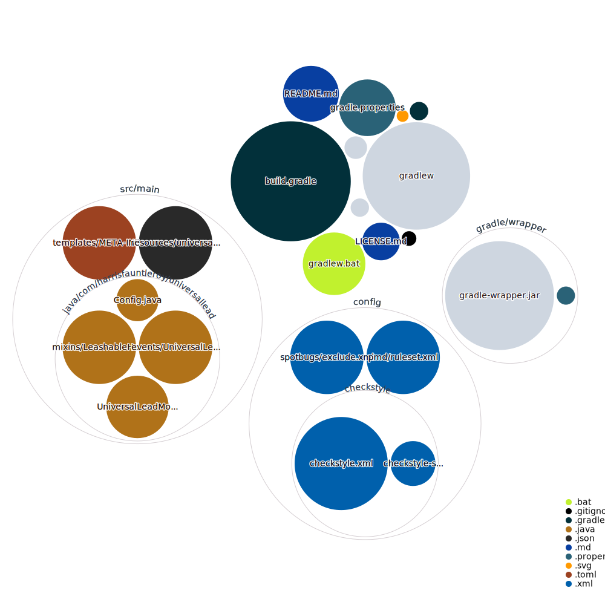

# Universal Lead

Lead and leash hostile mobs in Minecraft using vanilla leads

[](https://github.com/harrisfauntleroy/universal-lead/releases)
[](https://github.com/harrisfauntleroy/universal-lead/issues)
[](LICENSE)

Extends vanilla lead mechanics to work with hostile mobs like zombies, skeletons, and creepers. Works with all mobs that implement the Enemy interface.

## Getting Started

### Prerequisites

- Java 21
- Minecraft (version-specific - see branches)
- NeoForge mod loader

### Development Setup

```bash
git clone https://github.com/harrisfauntleroy/universal-lead.git
cd universal-lead
# Switch to target version branch
git checkout 1.21
./gradlew genIntellijRuns
```

### Build and Test

```bash
# Build mod
./gradlew build

# Run client
./gradlew runClient

# Run server
./gradlew runServer

# Refresh dependencies if needed
./gradlew --refresh-dependencies
```

## Core Features

- **Universal Leashing** - Lead any hostile mob with vanilla leads
- **Enemy Interface Support** - Works with all mobs implementing Enemy interface

## Technical Implementation

- **Language**: Java 21
- **Platform**: NeoForge
- **Integration**: Vanilla lead system extension
- **Build**: Gradle with NeoForge toolchain
- **Mappings**: Official Mojang mappings (see [license](https://github.com/NeoForged/NeoForm/blob/main/Mojang.md))

## Version Support

Each Minecraft version maintains its own branch:

- `1.21` - Minecraft 1.21.x
- `1.20` - Minecraft 1.20.x  
- `1.19` - Minecraft 1.19.x

Always use the correct branch for your target Minecraft version.

## Publishing

Create release with version tag:

```bash
git tag v1.0.0
git push origin v1.0.0
```

## Contributing

1. Fork the repository
2. Create feature branch (`git checkout -b feature/name`)
3. Commit changes (`git commit -m 'Description'`)
4. Push branch (`git push origin feature/name`)
5. Open Pull Request

Ensure you're working on the correct version branch for your changes.

## License

MIT License. See [LICENSE](LICENSE) for details.

---

For NeoForge documentation: <https://docs.neoforged.net/>

---


